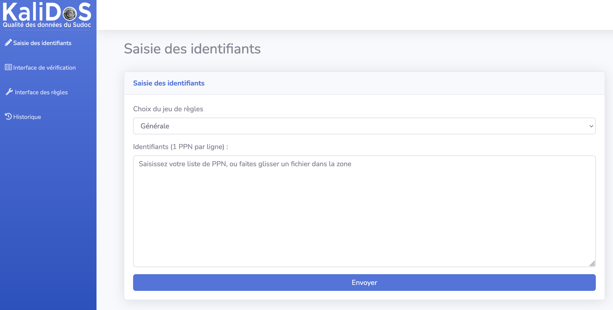
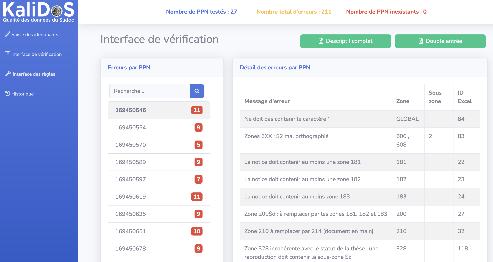
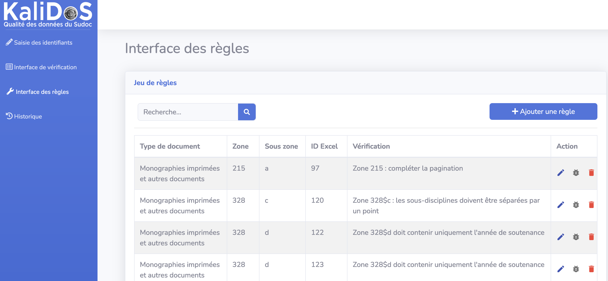
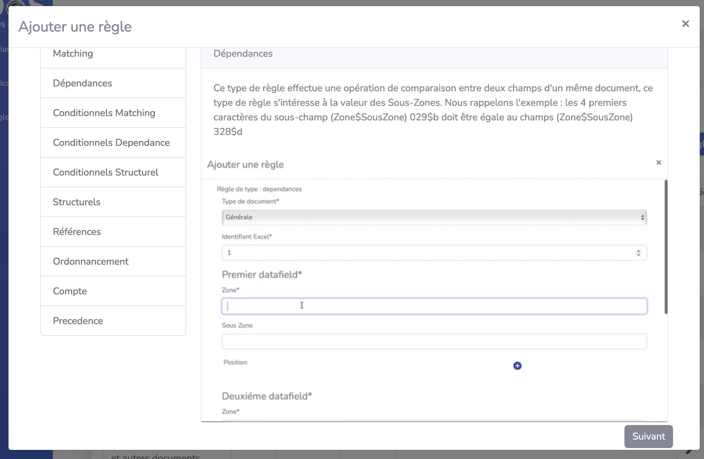
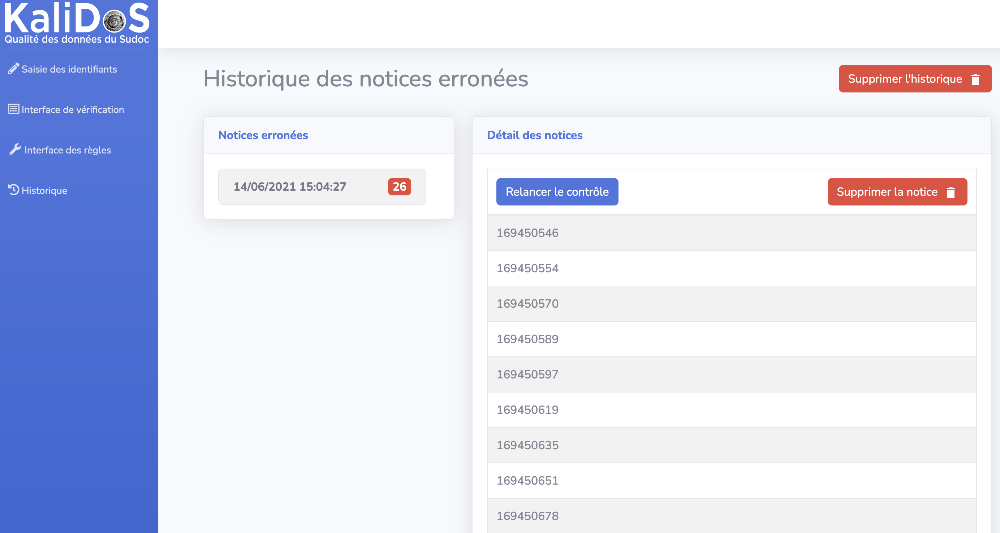

# KaliDoS

KaliDoS est une application web qui permet de vérifier la qualité de notices bibliographiques selon un jeu de règles.
Elle prend en entrée une liste de numéros PPN (identifiants de notices) et produit en sortie un rapport global et détaillé (erreurs pour chaque notice) qui est exportable au format Excel.
Cinq jeux de règles sont actuellement proposés (définis avec la BU de Lyon 1) mais une interface web permet d'en ajouter, d'en supprimer ou de les modifier.

L'application a été développée par des étudiants du Master Informatique de l'Université Lyon 1, en collaboration avec la BU, d'octobre 2020 à février 2021.

**Attention : le code de KaliDoS n'est actuellement plus maintenu, et l'ABES se charge de proposer un outil similaire pour le réseau.**

## Interfaces

 
L'écran d'accueil de KaliDoS, où l'on peut saisir des PPN à vérifier.

 
L'écran de résultats suite à une vérification de 27 PPN. Un résumé global apparait en haut, la liste des PPN erronnés apparait au milieu ("erreurs par PPN"). Ici, la notice _169450546_ est sélectionnée, elle contient 11 erreurs qui sont (en partie) affichées à droite. Les boutons verts permettent de télécharger ces résultats au format Excel (2 types d'affichage).

 
L'interface des règles. Le jeu de règles (ou type de document) est dans la première colonne. Les actions possibles sur une règle sont l'édition, le test (une popup apparait pour y coller une notice à tester) et la suppression.

 
L'interface d'ajout d'une règle liste les types de règles à gauche. En sélectionnant l'un des types, le panel de droite affiche une définition ainsi qu'un tutoriel pour ajouter une règle de ce type (sous forme d'image animée).

 
Enfin, l'interface d'historique permet de voir les vérifications effectuées. On peut directement re-vérifier les notices d'une vérification passée (ce qui est pratique pour vérifier s'il reste des erreurs).

## Installation

+ `npm run build` pour construire le projet.
+ `npm run start` pour lancer le serveur.

+ [librarie bootstrap](https://getbootstrap.com/) à mettre dans le répertoire `dist` (css + js)

Il est possible également de déployer l'application en utilisant Docker : [Guide de déploiement](doc/deploiement.md)

## Démo

Démo de l'application KaliDoS sur Heroku : [https://budev.herokuapp.com/#/](https://budev.herokuapp.com/#/)

## Documentation

[Documentation utilisateur](doc/doc-utilisateur.md)

[Présentation de KaliDoS](doc/presentation-KaliDoS.pptx)

[Documentation des règles](doc/regles.md)

[Liste des règles SCD UCBL (format Excel)](doc/controle-qualite-v5.xlsx)

[Documentation l'interface des règles](doc/interface-regles.md)

