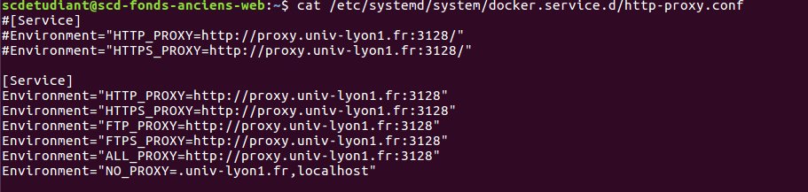

## Historique de l'intervention

> mise a jour de la configuration du proxy pour docker pour acceder au repot de la forge



> installation de docker compose

## Guide du deploiment 

### mode automatique 

Le deploiment a été automatisé grace a Gitlab CI, qui construit l'image de l'application avant de la deployer sur la machine virtuelle.
Ainsi il suffit de relancer une pipeline sur le projet pour redeployer l'application ou si il y a besoin de mettre a jour une nouvelle version de celle ci sur la machine.

Ce type de deploiment permet de redeployer completement l'application depuis la derniere version disponible sur le Git. L'utilisateur perdra ses données, c'est une remise a zero totale de l'application.

### mode manuel

> se connecter a la machine 
```
ssh scdetudiant@192.168.244.38
```

> relancer l'application
```
cd projet_bu
docker-compose up -d
```

Ces commandes permet de relancer l'application si celle ci a été stopper, par exemple apres une mise a jour de l'openstack ou la machine virtuelle est hebergée. Aucunne perte de données dans ce mode.