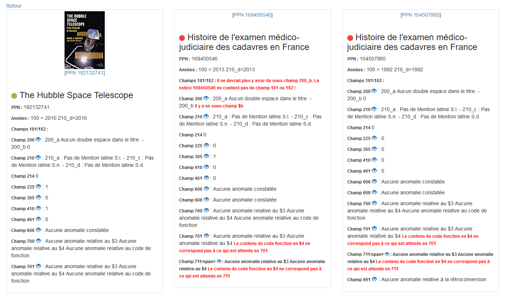

## Type d application
Appli web , un serveur localhost qui tournera sur le PC de la prof si c'est l'unique utilisateur. Possibilité de deployer le serveur si plusieurs utilisateurs 

=> plus modulable et plus facilement maintenable pour les suivants

## Quelle techno on va utiliser ? 
- NodeJS pour le back
- XPath pour la gestion du XML
- REST API ???

=> Possibilité de déployer rapidement et facilement un serveur Express
=> installation rapide de paquets et de librairies (Bootstrap,Jquery,etc...)
=> Problematique de "l'instalation" sur le PC de la prof, prévoir un guide d'utilisateur, script qui mache le travail vu qu'on aura pas d'executable windows
=> Utiliation de PKG pour generer des executables windows/mac/ubuntu

### Règles 


- champ A dependant du champ B 
- valeur présente
- caractères interdits dans une zone
- champs non complétés (valeur par défaut / placeholder toujours présente)
- information à 2 endroits doit être cohérente
- présence des identifiants (auteurs, matieres dans RAMEAU) - pas de
suggestion/auto-correction
- validation du numéro de zone (ex, traducteur - sous-champ $4 avec valeur codée
'traducteur' en 701 et pas 702)

 
- Utilisation de Regex
- Stockage des regles dans un fichier Json

```
{
	200 : "(.*)" -> valeur présente
	201 : "^(.*specialChar.*)" -> caractères interdits dans une zone
	202 : "(default|(.*))" -> champs non complétés
	203 {
		a: 
		b:
		c:"(.*champ204c.*)" -> information à 2 endroits doit être cohérente
		} 
	204 {
		z:
		b:
		c:"(.*champ203c.*)"
	}
	606{
		3:
		a:"([a-zA-Z\s]+)" -> matieres dans RAMEAU
		y:
		x:
		2:
	}
	700{
		3:
		a:"([a-zA-Z]+)" -> Auteur
		b:"([a-zA-Z]+)"
		4:
	}
	701 {
		3 : 
		b :
		f : 
		4 : "(code traducteur)"
	}
}
```

### Modification des regles
- par formulaire
	- visualisation des regles existantes
	- suppression d'une regle
	- ajout d'une regle
	- modification d'une regle

- créer un module pour generer les regex en fonction des entrées du formulaire
- editer le fichier json
